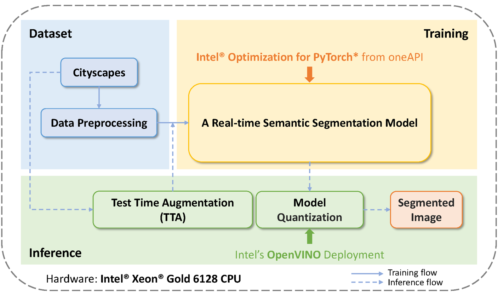
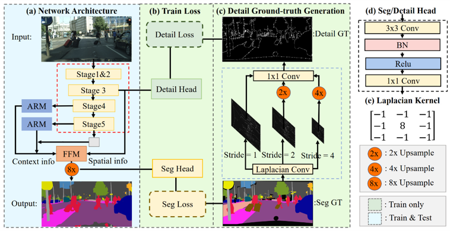
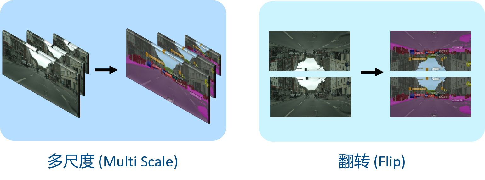
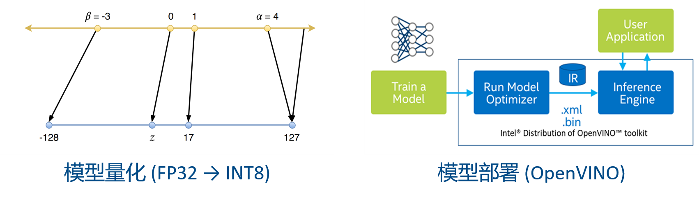
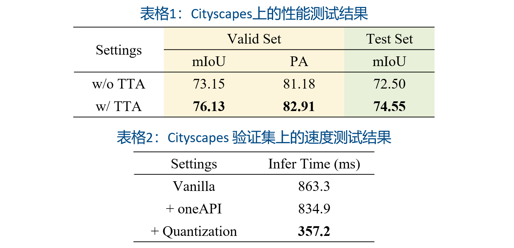

# Semantic Segmentation for Autonomous Vehicles

[主题一：自动驾驶车辆的对象检测](www.dev4one.com) 解决方案。

## 团队信息

- 团队名称：明日之星 
- 团队学校：华南理工大学
- 团队成员：翁浩瀚、卢沁旖

## 问题陈述

### 问题描述与要求 

使用计算机视觉技术和[英特尔® AI 分析工具套件](https://www.intel.com/content/www/us/en/developer/tools/oneapi/ai-analytics-toolkit.html)( Intel® AI Analytics Toolkit )为自动驾驶车辆开发实时对象检测模型。参赛团队需要创建一个深度学习模型，用于准确检测行人、车辆、交通标志和交通信号等对象。该模型需要具有高准确度和低延迟，能够满足自动驾驶车辆安全导航的需求。 

### 样本数据集

城市景观数据集 (Cityscapes)：这个数据集包含高分辨率的城市场景图像，专门用于城市场景语义理解任务。该数据集包含 30 类对象（行人、汽车、公共汽车、自行车等）的 5,000 幅图像，并带有精细注释。

本次挑战赛使用下列两个数据集文件：原始图片 leftImg8bit_trainvaltest.zip 和标记文件 gtFine_trainvaltest.zip 。 请使用该数据集内默认的训练、验证和测试集的划分，禁止把测试集加入到训练集中。

*以上数据源于https://www.cityscapes-dataset.com/ ，使用时请遵循相关网站的使用条款及使用符合规定的企业或机构邮箱完成注册，进入Download页面获取本次挑战赛指定的上述数据集。 

### 最终目标

1. 使用英特尔® AI 分析工具套件中的适当组件开发一个深度学习模型，用于准确、快速检测并对道路上的对象进行分割。 
2. 使用包括挑战赛指定的真实场景（如各种天气条件、光线条件和道路环境）的数据集测试模型。 
3. 尝试进行模型优化，以实现低延迟，以支持自动驾驶车辆进行实时对象检测。 
4. 鼓励参赛团队使用英特尔CPU或英特尔GPU完成项目。 
5. 基于项目决赛作品提交模版撰写一份详尽的报告，详述模型开发和测试过程中所采用的方法、实现的结果和面临的挑战。 

## 项目简介

### 整体框架

- **数据预处理**：我们对 Cityscapes 进行了常用的数据预处理，包括 resize, crop, flip 等。
- **训练**：基于[Intel® Optimization for PyTorch*](https://www.intel.com/content/www/us/en/developer/tools/oneapi/optimization-for-pytorch.html)，我们实现了一个实时的语义分割网络，在分割精度和推理时间上取得了较好的平衡。
- **推理**：我们使用了 TTA 提高了模型的分割精度，并对训练好的模型进行量化和基于[OpenVINO™ 工具套件](https://www.intel.cn/content/www/us/en/developer/tools/openvino-toolkit/overview.html)的部署，大大提高了推理速度。

## 技术方案

### 轻量级语义分割网络[1]

- 从图像提取细节，指导浅层模型学习**空间信息**；
- 从分割标签中获取内容，指导深层模型学习**语义信息**；

- 将原本分别提取语义和空间信息的双流模型融合为**单流模型**，减少了模型的参数。

### 测试时数据增强（TTA）

在测试时对模型使用了多尺度、翻转等数据增强手段，并将增强过的图片同时输入到网络中，对最后的推理结果进行集成。该方法一定程度上提高了模型的分割精度。

### 模型的量化和部署

- **量化**：将模型参数从原本的 float32 量化为 int8 ，减少了模型推理的计算量。
- **部署**：使用 Intel OpenVINO 对量化后的模型进行部署，进一步降低推理时间。

### 指标

- **计算设备**：Intel® Xeon® Gold 6128 CPU @ 3.40GHz

- **计算平台**：Intel® DevCloud 云测试环境

## 总结

本方案的亮点总结如下：

- 使用先进的轻量级分割网络，在减少运算的同时保持较高的性能。

- 使用测试时数据增强，进一步提高模型性能。

- 基于Intel oneAPI 和 Intel OpenVINO 实现模型的量化与部署，显著减少推理时间。

在本次黑客松挑战赛中，我们深入了解 Intel oneAPI 及其相关生态，并将其应用于实际的自动驾驶问题中，体验了其高效与便捷的特性，也感受到了其在未来人工智能应用落地中的无限潜力。在今后的人工智能研究与落地中，我们也会尝试着使用 oneAPI 其相关生态来提高模型的训练和推理速度。

###  引用

[1] Rethinking BiSeNet for Real-Time Semantic Segmentation, CVPR’21
